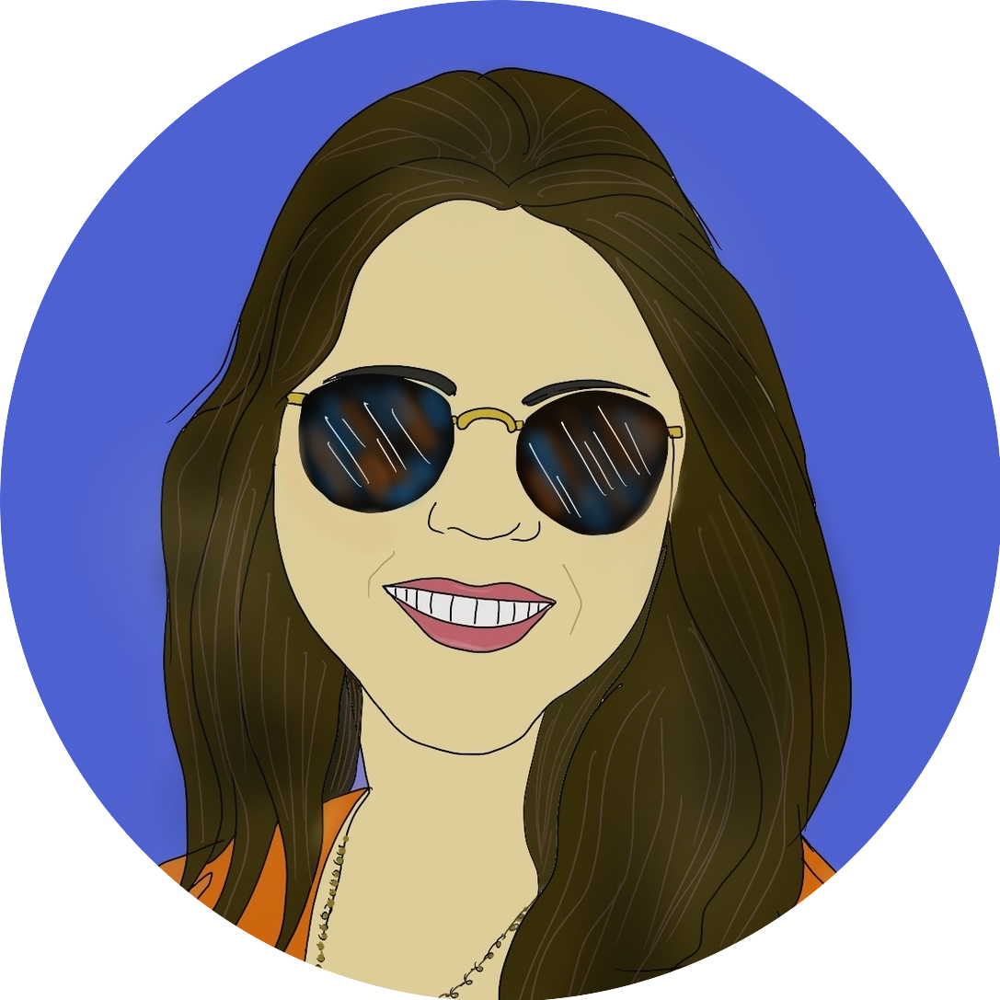

<h3 align="center">
<h3 align="center">Hi there, I'm Mariana Leitune Costa </h3>
<h3 align="center"></h3>

I'm a passionate person about technology with a background in law. After doing a postgraduate degree in Digital Law, I decided to study Web Development.
  
And finally, I became a Web Developer 🎉.

